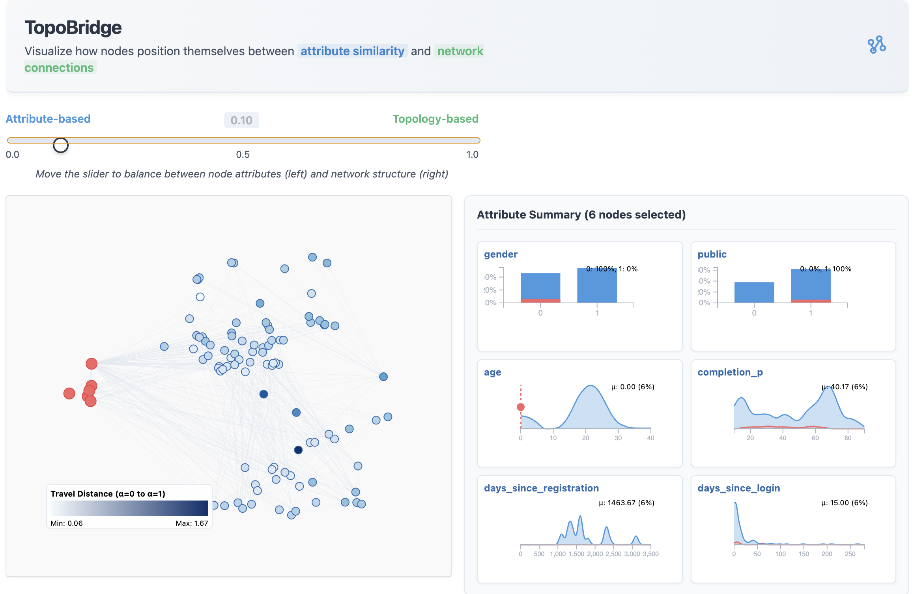

# TopoBridge

TopoBridge is a visualization widget that helps you explore how nodes position themselves between attribute similarity and network connections.



## Installation

Install from PyPI:

```sh
pip install topo_widget
```

or with [uv](https://github.com/astral-sh/uv):

```sh
uv add topo_widget
```

## Usage

```python
import TopoBridge
import networkx as nx

# Create your graph
G = nx.karate_club_graph()

# Create and display the widget
widget = TopoBridge.widget(G)
widget
```

Check the example notebook for a complete demonstration.

## Development

We recommend using [uv](https://github.com/astral-sh/uv) for development.
It will automatically manage virtual environments and dependencies for you.

```sh
uv run jupyter lab example.ipynb
```

Alternatively, create and manage your own virtual environment:

```sh
python -m venv .venv
source .venv/bin/activate
pip install -e ".[dev]"
jupyter lab example.ipynb
```

The widget front-end code bundles it's JavaScript dependencies. After setting up Python,
make sure to install these dependencies locally:

```sh
npm install
```

While developing, you can run the following in a separate terminal to automatically
rebuild JavaScript as you make changes:

```sh
npm run dev
```

Open `example.ipynb` in JupyterLab, VS Code, or your favorite editor
to start developing. Changes made in `js/` will be reflected
in the notebook.

## Contributing

Contributions are welcome! Please feel free to submit a Pull Request.
